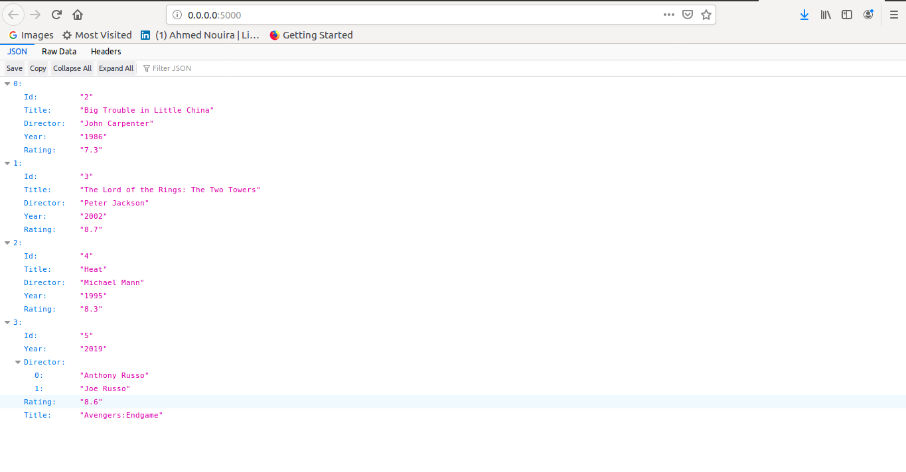
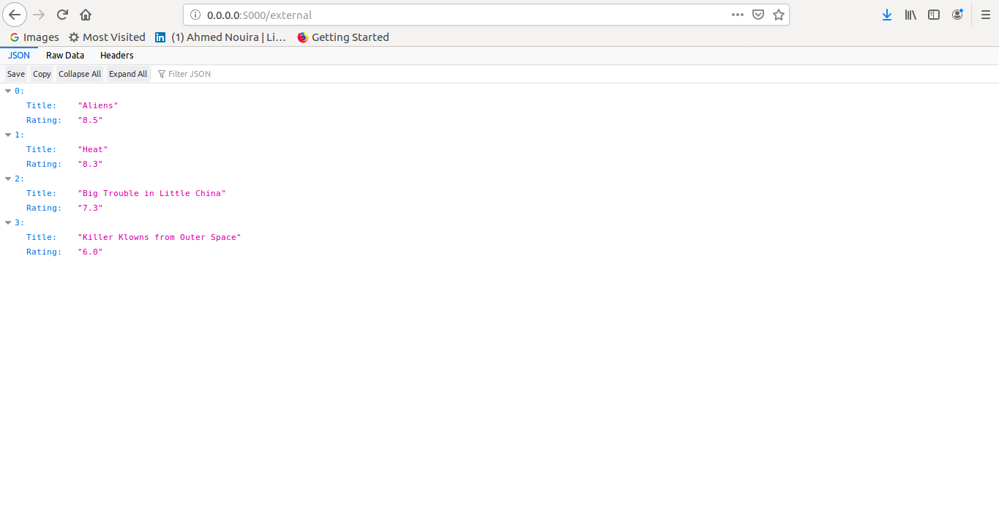

# express-restful-api-movies

Express RESTful API for movies.

# Running this app

1. As a standalone app running on your machine.

## I. As a standalone app

1. install [node.js](https://nodejs.org/en/) or run `sudo apt-get install nodejs`.
2. `git clone` the project then `cd` into the directory.
3. run `npm install` to install the application dependencies.

### 1. running the app

After installing, run the server using `npm start`.<br>
Access the running app in a browser at the URL written to the console (http://0.0.0.0:5000).

### 2. Testing the API

To test the API  implementation I will use **python** along with `requests` and `json` modules.

1. check if you have python installed in your machine `python`.
2. `pip install requests` to install requests module.

#### 2.1 **GET** request

* run the application.
* open another Terminal session `Ctrl + Shift + T` and run `python`, then enter the following code:

``` python

import requests
import json

res = requests.get('http://0.0.0.0:5000/')

res.json()

```


#### 2.2 **POST** request

* run the application.
* open another Terminal session `Ctrl+Shift+T` and run `python`, then enter the following code:

``` python

import requests
import json

movie = {"Id": "5", "Title": "Avengers:Endgame", "Director": "['Anthony Russo', 'Joe Russo']", "Year": "2019", "Rating": "8.6"}

res = requests.post('http://localhost:5000/', data=json.dumps(movie), headers={'Content-Type': 'application/json'})

res.json()

```


#### 2.3 **PUT** request

* run the application.
* open another Terminal session `Ctrl+Shift+T` and run `python`, then enter the following code:

**Note:** I gonna to update the **film Killer Klowns from Outer Space** film with **The Lord of the Rings: The Two Towers**.

```python

import requests
import json

movie =  {"Title": "The Lord of the Rings: The Two Towers", "Director": "Peter Jackson", "Year": "2002", "Rating": "8.7"}

res = requests.put('http://0.0.0.0:5000/3', data=json.dumps(movie), headers={'Content-Type': 'application/json'})

res.json()

```


#### 2.4 **DELETE** request

* run the application.
* open another Terminal session `Ctrl+Shift+T` and run `python`, then enter the following code:

**Note:** I gonna to delete the **Aliens** film.

```python

import requests
import json

res = requests.delete('http://192.168.1.5:5000/1')

res.json()

```



### 3. Customize the API representation

* Nagivate to (http://localhost:5000/external) and see the customized API representaion.



### 4. [IMDb]('https://www.imdb.com/') API request

<p align="center"><a href="https://www.imdb.com/?ref_=nv_home" target="\_blank"></a></p>

* Navigate to (http://localhost:5000/imdb) and see the customized API collected from IMDb.


